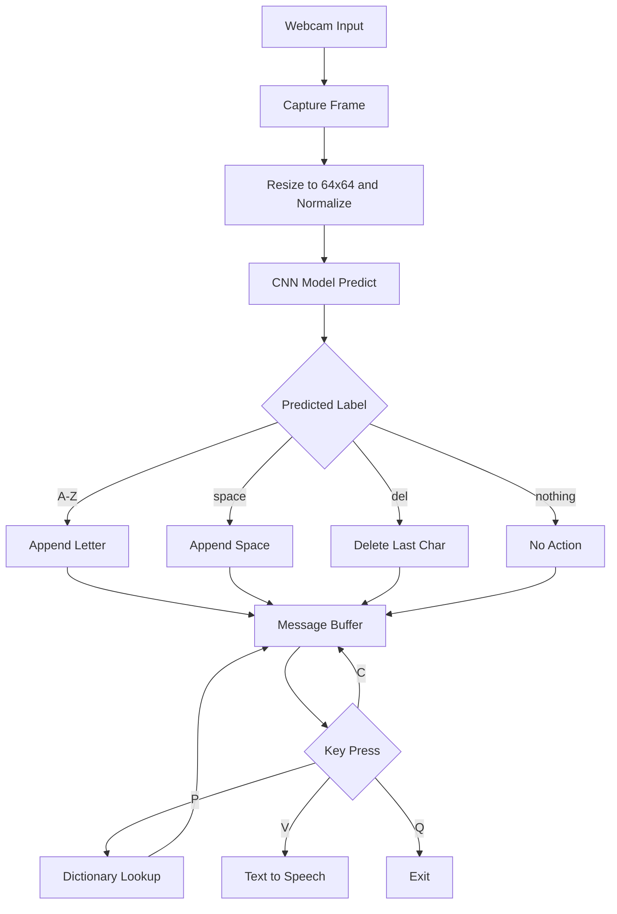

# American Sign Language (ASL) Detection

An AI-powered real-time sign language recognition system that detects ASL alphabet hand gestures using a Convolutional Neural Network (CNN) and translates them into readable text — with word prediction and text-to-speech support.

---

## Table of Contents

- [Overview](#overview)
- [System Flow](#system-flow)
- [Demo](#demo)
- [Features](#features)
- [Model Architecture](#model-architecture)
- [Dataset](#dataset)
- [Results](#results)
- [Installation](#installation)
- [Usage](#usage)
- [Keyboard Controls](#keyboard-controls)
- [Project Structure](#project-structure)
- [Future Work](#future-work)

---

## Overview

This project bridges the communication gap for the deaf and mute community by building a deep learning system that:
- Recognizes ASL alphabet gestures (A–Z + space, delete, nothing) from a live webcam feed
- Translates recognized gestures into text in real time
- Suggests word completions based on captured letters
- Reads the final message aloud using text-to-speech

---

## System Flow



---

## Demo

### No Sign Detected


*When no sign is present, the model outputs "nothing" and the message stays empty.*

### Letter Detection + Word Suggestion


*Letter "L" detected. After capturing "LI", the model suggests "libratory".*

### Word Auto-Complete + Final Message in Terminal


*Press `P` to auto-complete the word. Final message is printed in the terminal.*

---

## Features

- Recognizes all 26 ASL alphabets + `space`, `delete`, `nothing`
- Real-time webcam inference using OpenCV
- Word prediction from the current prefix using an English dictionary
- Text-to-speech output using `pyttsx3`
- Google Colab support with browser-based webcam capture
- Model trained and saved as `.h5` for easy reuse

---

## Model Architecture

Built using **TensorFlow** and **Keras**:

| Layer | Parameters | Output Shape |
|-------|-----------|-------------|
| Input | 64×64×3 | (64, 64, 3) |
| Conv2D | 32 filters, 3×3, ReLU | (62, 62, 32) |
| MaxPooling2D | 2×2 | (31, 31, 32) |
| Conv2D | 64 filters, 3×3, ReLU | (29, 29, 64) |
| MaxPooling2D | 2×2 | (14, 14, 64) |
| Conv2D | 128 filters, 3×3, ReLU | (12, 12, 128) |
| MaxPooling2D | 2×2 | (6, 6, 128) |
| Flatten | — | (4608,) |
| Dense | 128 neurons, ReLU | (128,) |
| Dropout | 0.5 | (128,) |
| Dense Output | 29 classes, Softmax | (29,) |

- **Total Parameters:** ~1.2 million
- **Optimizer:** Adam
- **Loss Function:** Categorical Cross-Entropy
- **Epochs:** 25 | **Batch Size:** 64

---

## Dataset

- **Source:** [Kaggle ASL Alphabet Dataset by grassknoted](https://www.kaggle.com/grassknoted/asl-alphabet)
- **Size:** ~87,000 images across 29 classes
- **Format:** JPG, 200×200px
- **Preprocessing:** Resized to 64×64, normalized to [0,1], one-hot encoded labels, data augmentation (rotation, flip, zoom, brightness)

---

## Results

| Metric | Score |
|--------|-------|
| Training Accuracy | 99% |
| Validation Accuracy | 96% |
| Test Accuracy | 95–97% |
| Real-Time Accuracy | ~92% |

> Real-time accuracy may vary with lighting conditions, hand size, and orientation.

---

## Installation

### 1. Clone the Repository

```bash
git clone https://github.com/HetShingala/asl-detection.git
cd asl-detection
```

### 2. Install Dependencies

```bash
pip install -r requirements.txt
```

### 3. Download the Dataset

Get the [ASL Alphabet Dataset](https://www.kaggle.com/grassknoted/asl-alphabet) from Kaggle and place the zip at:

```
datasets/asl/asl_alphabet_train.zip
```

### 4. Download Model

> The `.h5` model file exceeds GitHub's size limit. Download it from Google Drive and place it in the root folder as `asl_model_final.h5`.  
> *(Add your Google Drive link here once uploaded)*

---

## Usage

### Run Real-Time Detection (Local PC)

```bash
python sign_language_detection.py
```

### Train the Model (Google Colab)

Open `train_model.ipynb` in Google Colab and run all cells. Model saves to your Google Drive.

### Webcam in Google Colab

Open `colab_webcam.ipynb` in Google Colab — captures a photo from your browser and predicts the ASL letter.

---

## Keyboard Controls

| Key | Action |
|-----|--------|
| `C` | Capture current predicted letter |
| `P` | Auto-complete current word using dictionary |
| `V` | Speak the message aloud (text-to-speech) |
| `Q` | Quit the application |

---

## Project Structure

```
asl-detection/
│
├── sign_language_detection.py   # Real-time PC webcam detection
├── train_model.ipynb            # CNN training notebook (Google Colab)
├── colab_webcam.ipynb           # Webcam capture + prediction in Colab
├── requirements.txt             # Python dependencies
├── words_alpha.txt              # English dictionary for word prediction
├── screenshots/
│   ├── screenshot1.png
│   ├── screenshot2.png
│   └── screenshot3.png
└── README.md
```

> ⚠️ `asl_model_final.h5` is not in the repo due to GitHub's 100MB file limit. Host it on Google Drive and link it above.

---

## Future Work

- Extend to dynamic gesture recognition (full words and sentences)
- Incorporate facial expression and body pose estimation
- Deploy as a mobile or web application
- Train on diverse backgrounds for better generalization

---

## References

- [TensorFlow Documentation](https://www.tensorflow.org/)
- [ASL Alphabet Dataset – Kaggle](https://www.kaggle.com/grassknoted/asl-alphabet)
- [OpenCV Documentation](https://docs.opencv.org/)
- [Keras API Docs](https://keras.io/)
- [WebRTC API – MDN](https://developer.mozilla.org/en-US/docs/Web/API/WebRTC_API)

---

*Built by Het Shingala (22BIT014) — Pandit Deendayal Energy University*
